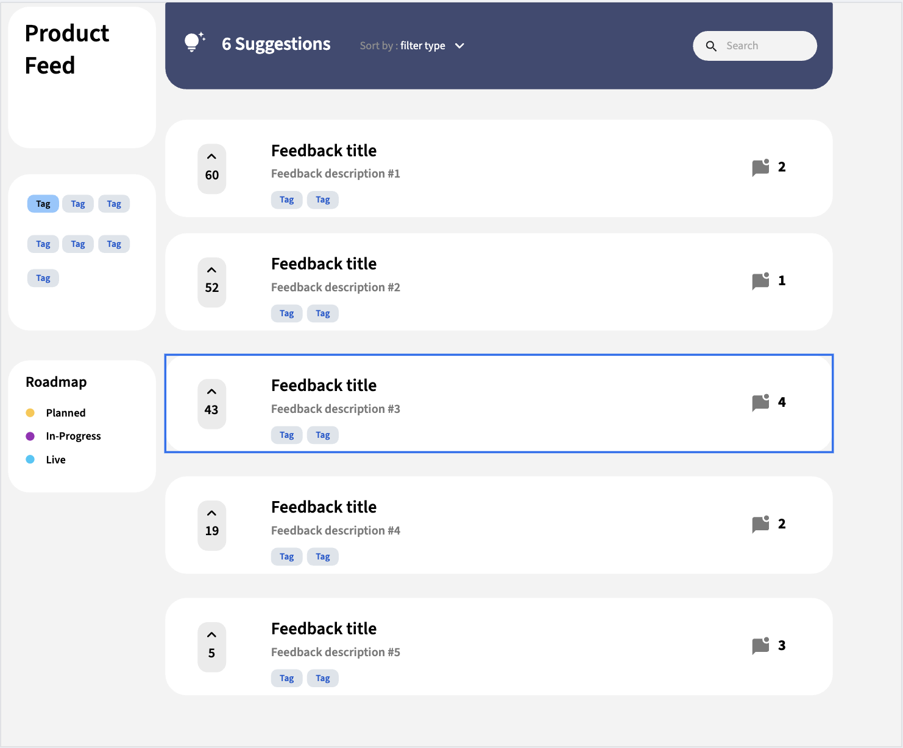

# CS408-Final-Project

### What is the general theme?
The general theme of this project is a SaaS product feedback board, designed as a simplified feature request and voting system. This type of application serves as a centralized platform where users can interact with product development teams in a structured and organized manner. Similar to popular feedback tools used by modern software companies, this application creates a communication channel between users and developers. The feedback board concept is quite important in the tech industry as companies seek to build products that truly meet user needs and prioritize features based on actual user demand rather than on assumptions.

### What is it going to do?
The application will allow users to submit product feedback and feature requests, vote on submissions from other users, and engage in discussions through comments. At its core, the system will help product teams prioritize development by showing the most-requested features through its voting system, while providing transparency to users about what's being worked on through clear status labels. Users will be able to browse through existing feedback items, filter them by category (such as bugs, feature requests, enhancements, or UI/UX improvements), and search for specific topics of interest. Each feedback item will display key information including the title, description, number of votes, current status (such as "Planned," "In Progress," "Completed," or "Under Review"), and associated comments from the community. The voting mechanism ensures that the most valuable or urgent feedback rises to the top, which gives product teams clear insights into what their users truly want. The commenting system allows for deeper discussion and clarification around each piece of feedback, allowing users to add additional context, use cases, or alternative suggestions that make the original submission better.

### Who is the target audience?
The target audience is customers and users of SaaS products who want a voice in the product's development. These users are typically engaged with the product they're using and have ideas, suggestions, or concerns they want to communicate to the development team. They want to suggest features that would improve their workflow, report bugs that are hindering their experience, and see what improvements are being worked on so they can keep upcoming changes in mind. This audience values transparency and appreciates when their feedback is heard and acknowledged. They represent a diverse group that could include business professionals using productivity software, creative professionals using design tools, developers using technical platforms, or any other category of SaaS users who are invested enough in their tools to want to influence their development.

### What sort of data will it manage?
The application will manage several types of user-generated dynamic data. First and foremost, it will handle feedback submissions, which include the title of the request, a detailed description explaining the feedback or feature, the assigned category or tag (such as "Bug," "Feature Request," "Enhancement," or "UI/UX"), the current status of the item, and a timestamp indicating when it was created. The system will also track which user submitted each piece of feedback for accountability and reference purposes. Second, the application will manage upvotes, maintaining a record of which users have voted on which feedback items to prevent duplicate voting while keeping an accurate count of total votes for each submission. Third, it will store user comments and discussions attached to each feedback item, including the comment text, timestamp, and the user who posted it. Fourth, the system will maintain user account information including usernames for identification, email addresses for account management and potential notifications, and securely hashed passwords for authentication. Finally, it will manage the categories and tags themselves, which can be applied to feedback items to facilitate organization and filtering.

### Stretch Goals?
Stretch goals include implementing an admin dashboard for product team members to manage feedback status and add official responses, which would create a distinction between regular users and team members who can moderate and update content. Email notifications could be added to alert users when feedback items they submitted or voted on receive status updates, new comments, or official responses from the team. Image upload capability would allow users to attach screenshots to bug reports or mockups to feature requests, potentially making feedback easier to understand. User profile pages would display a history of all feedback submissions and comments from individual users, which may allow users to build reputations as valuable contributors.

